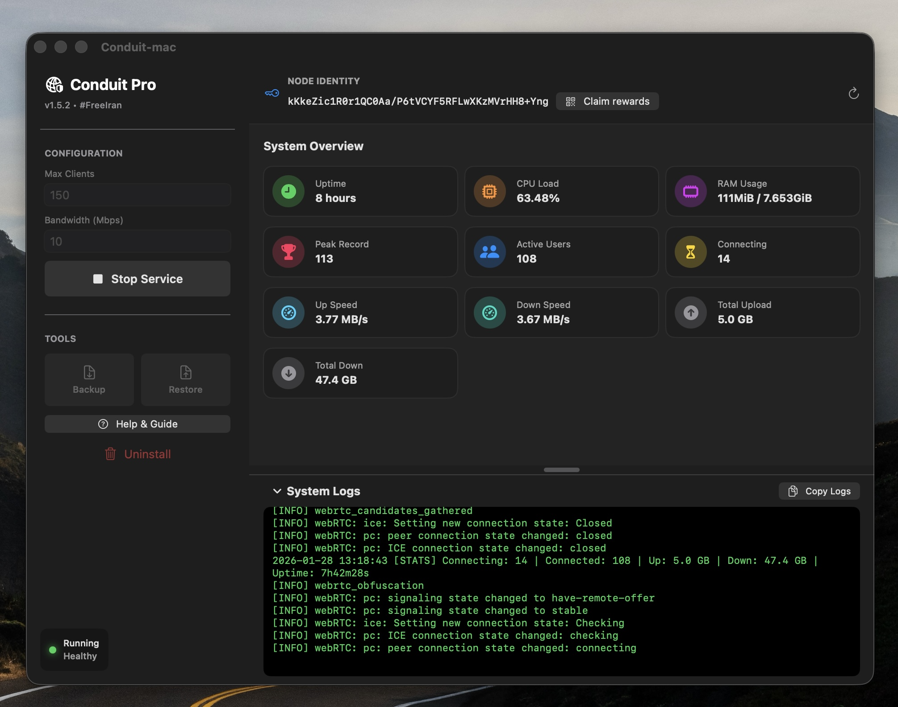

<div align="center">

# 🌐 Conduit Pro for macOS

### The easiest way to run, monitor, and manage a Psiphon Conduit node on macOS

### 📖 [Easy Installation Help](https://polamgh.com/conduit)

Helping people in censored regions access the free Iran. 🕊️


<br><br>

**[English](#-quick-start) · [فارسی](#-راهنمای-نصب-فارسی)**

---

</div>

## ✨ Key Features

| Feature | Description |
|---------|-------------|
| 🚀 **One-Click Install** | No complex terminal commands. Just one line to setup everything. |
| 🖥️ **Native Dashboard** | Beautiful macOS app to monitor CPU, RAM, and Speed. |
| 🎁 **Claim Rewards** | Built-in QR Code generator to claim your node rewards in Ryve. |
| 🛡️ **Security Hardened** | Runs in an isolated Docker container with read-only filesystem. |
| 🔄 **Auto Update** | Keep your node up-to-date with a single click. |
| 🆔 **Identity Backup** | Easily Backup & Restore your node_key to keep your reputation. |

---

## 🚀 Quick Start

### 1. Prerequisites

You must have **Docker Desktop** installed and running.

[Download Docker Desktop for Mac →](https://www.docker.com/products/docker-desktop)

### 2. Installation Options

#### Option A: Homebrew (Recommended) ✅

If you have Homebrew installed, simply run:

```bash
brew install --cask conduit
```

#### Option B: Automatic Install ✅

Open your Terminal app and paste this command. It automatically downloads, installs, and fixes permissions:

```bash
curl -fsSL https://raw.githubusercontent.com/polamgh/Conduit-Pro/main/install.sh | bash
```

#### Option C: Manual Download

If you prefer to download the file yourself:

1. Go to the [Releases Page](https://github.com/polamgh/Conduit-Pro/releases)
2. Download `Conduit.zip` or `Conduit Pro.zip`
3. Unzip and move the app to your Applications folder
4. Right-click and select "Open" to bypass security warnings (if needed)

### 3. Usage

1. Open **Conduit** from your Applications folder
2. Set your **Max Clients** (e.g., 200) and **Bandwidth**
3. Click **Start Service**
4. Wait for the status to turn **Running & Healthy**

> **Note:** It may take 1 to 24 hours for the Psiphon network to discover your node and for users to connect. Please be patient if you see "0 Users" initially.

---

## 🎁 How to Claim Rewards

1. Open the app and ensure the service is **Running**
2. Click the **Claim Rewards** button (or QR icon)
3. Scan the generated QR Code using the **Ryve App**
4. Your node is now linked to your wallet!---

## 🛠 Troubleshooting

| Issue | Solution |
|-------|----------|
| **Docker not found?** | Ensure Docker Desktop is running. The app will prompt you to open it if it's closed. |
| **Permission Denied?** | The app automatically fixes permissions. If you built it from source, remove App Sandbox in Xcode. |
| **No Users Connecting?** | Check if your internet allows UDP traffic. Using a personal hotspot or changing ISPs might help. Also, give it up to 24 hours. |

---

## 📄 License

This project is open-source and licensed under the **[MIT License](LICENSE)**.

<div align="center">

---

**Built with ❤️ for #FreeIran**

</div>

---

<div dir="rtl" align="right">

# 🍎 راهنمای نصب فارسی

### مدیریت آسان نودهای Conduit روی مک‌بوک
بدون نیاز به دانش فنی، نود خود را راه‌اندازی کنید و به اینترنت آزاد کمک کنید.

---

## ✨ ویژگی‌ها

| ویژگی | توضیح |
|------|--------|
| 🚀 **نصب آسان** | تنها با یک خط دستور یا دانلود مستقیم. |
| 🖥️ **داشبورد گرافیکی** | مشاهده سرعت لحظه‌ای، تعداد کاربران و مصرف منابع. |
| 🎁 **دریافت پاداش** | تولید خودکار کد QR برای اپلیکیشن Ryve. |
| 🛡️ **امنیت بالا** | اجرا در محیط ایزوله داکر. |

---

## 📥 روش‌های نصب

### 1. پیش‌نیاز

ابتدا برنامه **Docker Desktop** را روی مک خود نصب و اجرا کنید.

[دانلود Docker Desktop برای Mac →](https://www.docker.com/products/docker-desktop)

### 2. نصب (دو روش)

#### روش اول: نصب خودکار (پیشنهادی) ✅

ترمینال را باز کنید و دستور زیر را اجرا کنید (این روش تمام مجوزها را خودکار تنظیم می‌کند):

```bash
curl -fsSL https://raw.githubusercontent.com/polamgh/Conduit-Pro/main/install.sh | bash
```

#### روش دوم: دانلود دستی

1. به صفحه [Releases](https://github.com/polamgh/Conduit-Pro/releases) بروید
2. فایل فشرده (`Conduit.zip` یا `Conduit Pro.zip`) را دانلود کنید
3. برنامه را در پوشه Applications کپی کنید
4. اگر موقع باز کردن خطا داد، روی برنامه کلیک راست کنید و Open را بزنید

### 3. اجرا

1. برنامه **Conduit** را از پوشه Applications باز کنید
2. تنظیمات دلخواه (تعداد کاربر و پهنای باند) را وارد کنید
3. دکمه **Start Service** را بزنید
4. صبر کنید تا وضعیت **Running & Healthy** شود

> **⚠️ نکته مهم:** پس از روشن کردن سرور، ممکن است بین ۱ تا ۲۴ ساعت طول بکشد تا شبکه نود شما را شناسایی کند و کاربران متصل شوند. لطفاً صبور باشید.

---

## 🎁 چگونه پاداش خود را دریافت کنید

1. برنامه را باز کنید و مطمئن شوید سرویس **Running** است
2. روی دکمه **Claim Rewards** (یا آیکون QR) کلیک کنید
3. کد QR ایجاد شده را با اپلیکیشن **Ryve** اسکن کنید
4. نود شما اکنون به کیف پول شما متصل است!

</div>